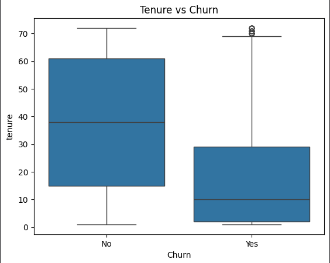
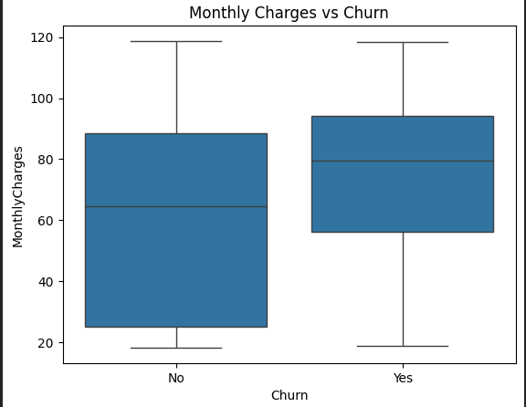
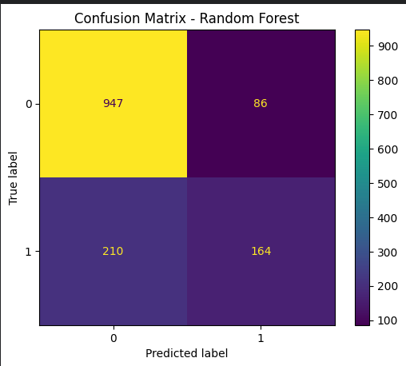
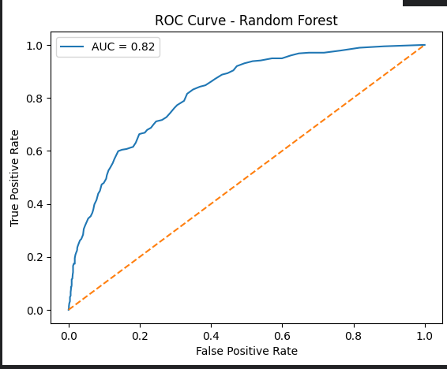

# Customer Churn Prediction

## 1. Overview

This project aims to predict customer churn in a subscription-based business environment using machine learning techniques. Customer churn refers to customers who discontinue using a service, directly impacting revenue, customer lifetime value, and long-term business sustainability.

From a business perspective, retaining existing customers is significantly more cost-effective than acquiring new ones. By identifying customers at risk of churning, organisations can implement targeted retention strategies such as personalised offers, improved customer support, and pricing adjustments.

This project approaches churn prediction as a binary classification problem, where the goal is to predict whether a customer will churn (Yes) or not (No).

---

## 2. Objectives

- Identify key drivers of customer churn  
- Build predictive models to classify churn risk  
- Evaluate model performance using appropriate metrics  
- Generate actionable business insights to reduce churn  

---

## 3. Data Understanding & Exploration

The dataset contains customer demographic, service, and billing-related information. Key features include tenure, monthly charges, contract type, and payment method.

### 3.1 Key Observations

- Churn is not evenly distributed across customers  
- Behavioral and pricing factors influence churn  
- Early indicators suggest customer lifecycle stage is critical  

---

## 3.2 Feature Relationships

### Tenure vs Churn


Customers who churn tend to have significantly lower tenure compared to those who stay. This indicates that customer attrition is more likely to occur early in the customer lifecycle.

From a business perspective, this highlights the importance of strengthening onboarding and early engagement strategies to improve retention.

---

### Monthly Charges vs Churn


Customers with higher monthly charges show a higher likelihood of churn. This suggests that pricing sensitivity plays a role in customer retention.

From a business standpoint, this may indicate a need to reassess pricing strategies, introduce bundled offerings, or provide targeted incentives for high-risk customers.

---

## 4. Data Preprocessing

The following steps were performed to prepare the data:

- Handling missing values  
- Converting `TotalCharges` to numeric format  
- Encoding categorical variables using one-hot encoding  
- Train-test split for model validation  

These steps ensured the dataset was clean, structured, and suitable for machine learning models.

---

## 5. Model Development

Three machine learning models were developed and evaluated:

- Logistic Regression (baseline model)  
- Decision Tree (interpretable, captures non-linear patterns)  
- Random Forest (ensemble model for improved performance)  

These models were selected to compare both simple and more advanced approaches to classification.

---

## 6. Model Evaluation

### Confusion Matrix (Random Forest)


The confusion matrix shows the model’s classification performance:

- True Negatives: Correctly identified non-churn customers  
- True Positives: Correctly identified churn customers  
- False Positives: Customers incorrectly flagged as churn  
- False Negatives: Churned customers not identified  

---

### ROC Curve (Random Forest)


The ROC curve evaluates the trade-off between true positive rate and false positive rate.

- The AUC score of approximately **0.82** indicates strong overall model performance  
- The model demonstrates good ability to distinguish between churn and non-churn customers  

---

## 7. Key Insights

- Customers with **short tenure** are significantly more likely to churn  
- Customers with **higher monthly charges** show increased churn risk  
- Churn is driven by identifiable behavioral and pricing patterns  

Importantly, a key trade-off was observed:

> While Random Forest achieved the strongest overall accuracy and an AUC of approximately 0.82, the Decision Tree demonstrated higher recall for churned customers. This highlights the trade-off between overall predictive performance and the ability to identify at-risk customers.

---

## 8. Business Recommendations

Based on the findings, the following strategies are recommended:

- **Strengthen onboarding experience** to reduce early-stage churn  
- **Implement targeted retention strategies** for high-risk customers  
- **Reassess pricing structures** for customers with high monthly charges  
- **Use predictive outputs** to drive proactive engagement  

Example intervention:
Customers in their first 6 months with higher monthly charges can be proactively targeted with personalised onboarding support or retention incentives.

---

## 9. Conclusion

This project demonstrates the end-to-end application of a machine learning pipeline to predict customer churn and generate actionable insights.

By combining data analysis with predictive modelling, organisations can shift from reactive to proactive retention strategies, improving customer lifetime value and operational efficiency.

---

## 10. Tools & Technologies

- Python  
- Pandas & NumPy  
- Scikit-learn  
- Matplotlib & Seaborn  
- Google Colab  
- GitHub  

---

## 11. Project Structure

```
customer-churn-prediction/
│
├── README.md
├── Maica_Erika_Catalan_Pillar_5_Capstone_Project.ipynb
├── tenure_vs_churn.png
├── monthly_charges_vs_churn.png
├── confusion_matrix.png
├── roc_curve.png
```

---

## 12. Author

**Maica Erika Catalan**  
Global Lead – Process Optimization & Innovation  
Automation & Analytics
